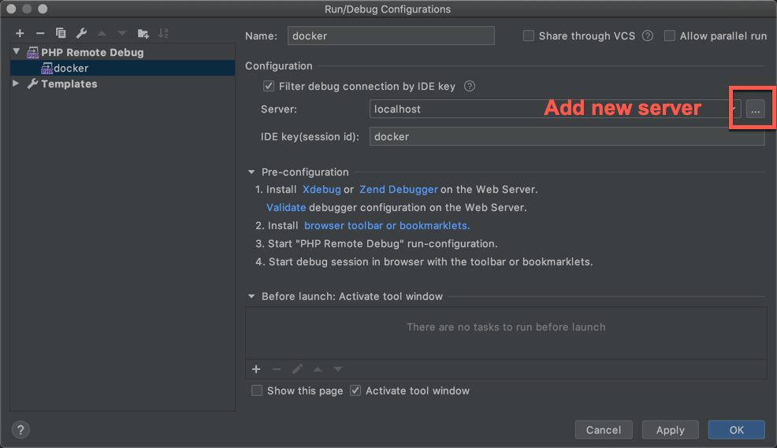
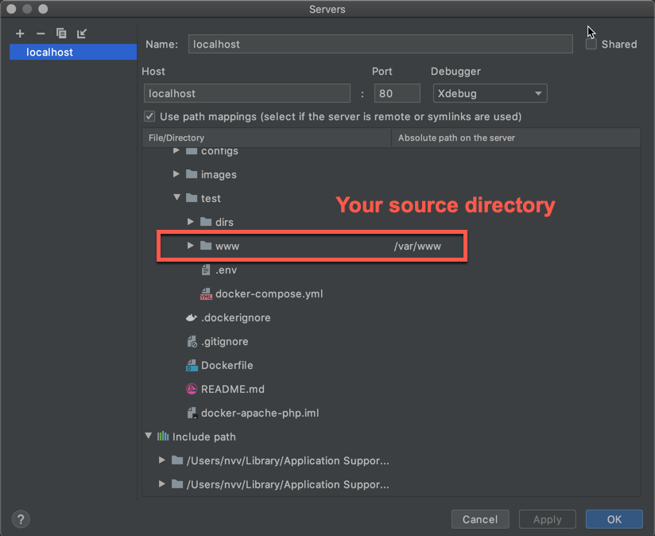

This is Apache + PHP 7.3 Docker Image

## Installed packages:

- nodejs
- yarn
- grunt
- gulp
- composer
- git
- wget
- imagemagick
- msmtp
- unzip
- memcached
- mc
- openssh-server
- gnupg
- poppler-utils
- ghostscript
- jpegoptim
- optipng
- pngquant
- gifsicle
- curl

## Installed PHP libraries:

- mcrypt
- xdebug
- bcmath
- curl
- exif
- intl
- mbstring
- pdo_mysql
- mysqli
- opcache
- pcntl
- pdo_mysql
- simplexml
- soap
- xml
- xsl
- zip
- tokenizer
- json
- iconv
- ldap

## XDebug

- XDebug is turned **off** by default
- **_Only_** for Windows - open port `9000` in firewall (or public network for Idea)
- **_Only_** for MAC OS - you need to alias your local IP: `sudo ifconfig en0 alias 10.254.254.254 255.255.255.0`
- Create `PHP Remote Debug` and set **Idea key** to `docker`

- Create **Server** and set directory mappings

- **_Note_** that the last Intellij Idea creates connection on first run. You just to accept connection

## Build commands

    docker build -t php7-apache .
    docker tag php7-apache:latest vnemchenko/php7-apache:latest
    docker push vnemchenko/php7-apache:latest

## Full docker-compose configuration

      application:
        image: vnemchenko/php7-apache
        volumes:
          - ${APPLICATION}:/var/www
          - ${DOCKER_CONFIGS}/custom.ini:/usr/local/etc/php/conf.d/custom.ini
          - ${DOCKER_CONFIGS}/xdebug.ini:/usr/local/etc/php/conf.d/xdebug.ini
          - ${DOCKER_CONFIGS}/opcache.ini:/usr/local/etc/php/conf.d/opcache.ini
          - ${DOCKER_CONFIGS}/apache2.conf:/etc/apache2/apache2.conf
          - ${DOCKER_CONFIGS}/virtualhost.conf:/etc/apache2/sites-enabled/virtualhost.conf
          - ${DOCKER_CONFIGS}/msmtprc:/etc/msmtprc
          - ${DOCKER_TMP_DIRS}:/tmp/php
          - ${DOCKER_LOG_DIRS}:/tmp/logs
        ports:
          - ${APP_HTTP_PORT}:80
          - ${APP_HTTPS_PORT}:443
        environment:
          - PHP_IDE_CONFIG=${PHP_IDE_CONFIG}
          - XDEBUG_CONFIG=${XDEBUG_CONFIG}
          
## Minimal docker-compose configuration

      application:
        image: vnemchenko/php7-apache
        volumes:
          - ${APPLICATION}:/var/www
        ports:
          - ${APP_HTTP_PORT}:80
